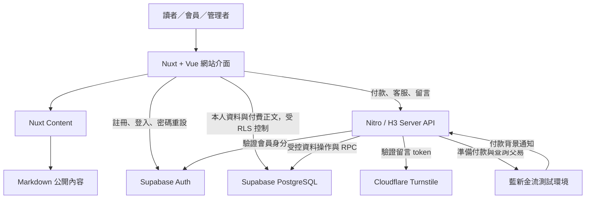
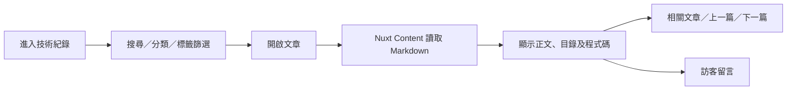
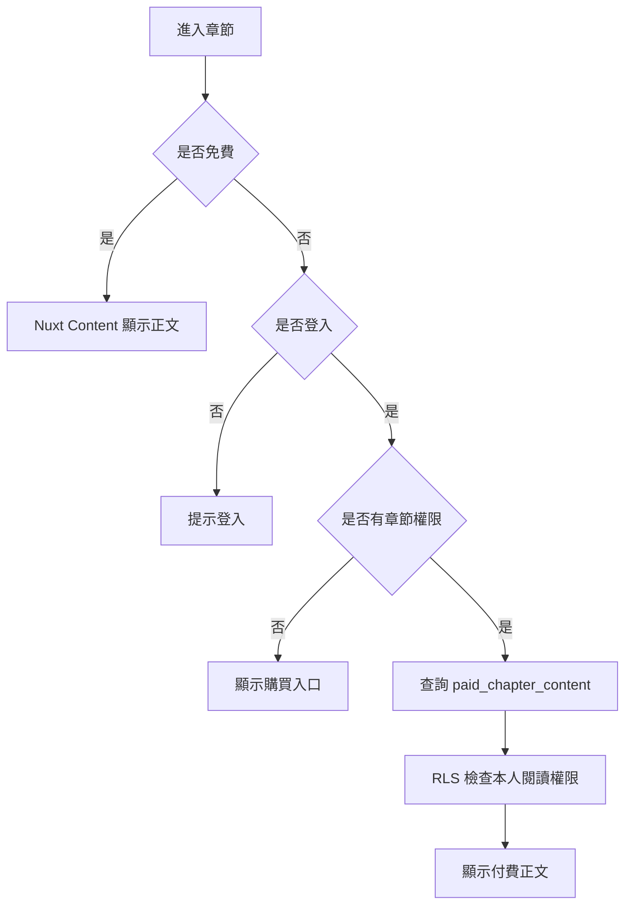
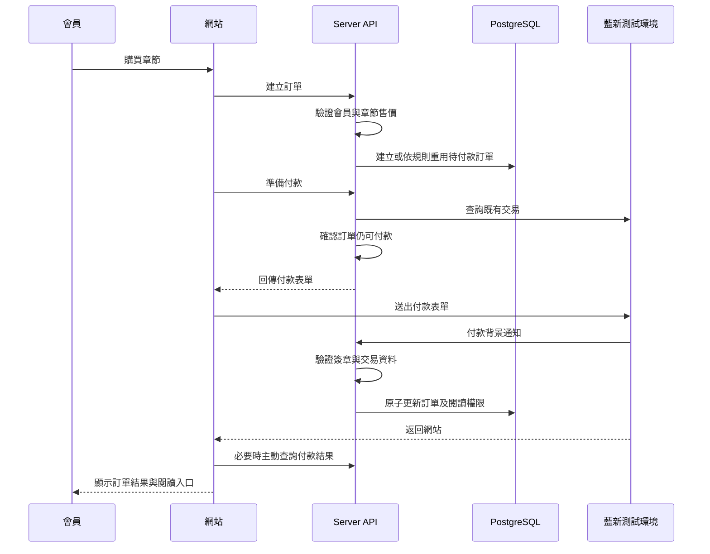
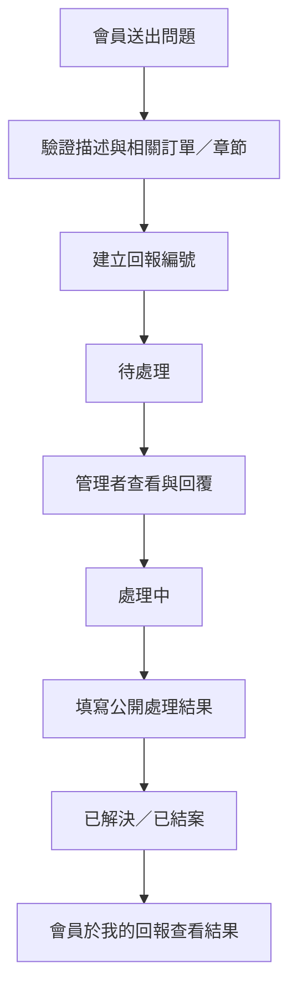
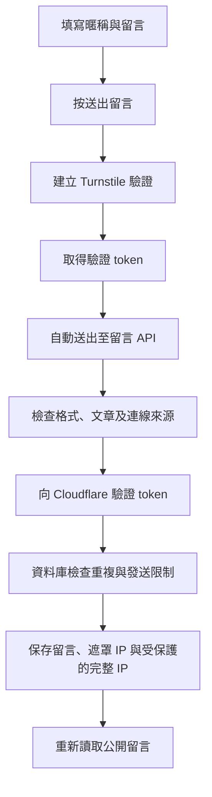

# MYBB｜技術紀錄與數位閱讀平台

MYBB 是以 Nuxt 建立的個人內容網站，整合技術文章、小說閱讀、會員帳號、付費章節、客服回報與訪客留言。

網站以 Markdown 管理公開內容，使用 Supabase 儲存會員相關資料與受保護的付費正文，並透過 Nuxt 的伺服器 API 處理付款、客服與留言驗證。

- 網站：https://mytool-mybb.vercel.app
- 網站語言：繁體中文
- 本機開發網址：http://localhost:3000
- 金流狀態：目前限定藍新金流測試環境

> 本文件描述目前專案的實作方式。程式碼、資料庫 migrations 與環境設定需要配合部署；建立 SQL 檔案不會自動更新遠端資料庫。

---

## 目錄

1. [網站功能](#網站功能)
2. [使用技術](#使用技術)
3. [系統架構](#系統架構)
4. [專案目錄](#專案目錄)
5. [主要頁面](#主要頁面)
6. [資料儲存與權限](#資料儲存與權限)
7. [網站運作流程](#網站運作流程)
8. [API 一覽](#api-一覽)
9. [本機環境設定](#本機環境設定)
10. [新增與維護內容](#新增與維護內容)
11. [管理者操作](#管理者操作)
12. [資料庫版本管理](#資料庫版本管理)
13. [部署方式](#部署方式)
14. [測試與驗證](#測試與驗證)
15. [常見問題](#常見問題)
16. [目前限制](#目前限制)

---

## 網站功能

### 技術紀錄

- 使用 Markdown 撰寫文章。
- 以 YAML Frontmatter 設定標題、描述、日期、分類與標籤。
- 提供關鍵字搜尋、分類篩選與標籤篩選。
- 文章頁提供桌面版與行動版目錄。
- 捲動閱讀時標示目前所在章節。
- 顯示上一篇、下一篇與相關文章。
- 支援程式碼語法高亮。
- 提供文章 SEO 資訊、Canonical URL 與 Article 結構化資料。

目前搜尋範圍包含文章標題、描述、分類與標籤，不是全文搜尋引擎。

### 小說閱讀

- 小說列表、作品介紹與章節列表。
- 免費與付費章節分流。
- 已購買章節權限判斷。
- 閱讀字體大小調整。
- 明亮、泛黃與深色閱讀模式。
- 本機閱讀設定與進度保存。
- 會員雲端閱讀進度。
- 閱讀書籤與備註。
- 從會員中心繼續閱讀或跳回書籤位置。

### 會員中心

- Email 與密碼註冊、登入及登出。
- 忘記密碼與重設密碼。
- 已解鎖章節查詢。
- 最近閱讀紀錄。
- 書籤查詢與刪除。
- 訂單紀錄、狀態篩選與分頁。
- 付款狀態查詢。
- 客服回報與處理結果入口。

### 章節付款

- 由伺服器建立訂單。
- 金額以伺服器讀取的章節資料為準。
- 串接藍新金流測試付款頁。
- 接收付款背景通知。
- 主動查詢交易結果。
- 確認付款後更新訂單並開通閱讀權限。
- 防止重複通知造成重複開通。
- 重新付款前先確認既有交易狀態。

目前支援流程以一般信用卡測試付款為主，尚未開放正式收款。

### 客服回報

- 登入會員可送出問題。
- 可附帶相關章節或本人訂單。
- 產生回報編號。
- 「我的回報」提供歷史紀錄、狀態及客服回覆。
- 管理者可查看所有案件、回覆與更新狀態。
- 管理者可記錄不公開的內部備註。
- 已解決或結案時必須提供公開處理結果。
- 使用版本檢查，避免多人處理時覆蓋其他人的更新。

### 技術文章留言

- 不需會員資格即可留言。
- 填寫暱稱與留言內容。
- 按下送出後才啟動 Turnstile 驗證。
- 驗證成功後自動送出留言。
- 留言以純文字顯示。
- 支援分頁與重新載入。
- 公開顯示遮罩 IP。
- 管理者可另外查詢完整 IP。
- 提供發送冷卻、每日上限與重複留言檢查。

訪客暱稱未經身分驗證；IP 也不等同個人身分。

---

## 使用技術

以下版本範圍來自 `package.json`，實際安裝版本以 `package-lock.json` 為準。

| 技術 | 版本／形式 | 專案用途 |
|---|---|---|
| Node.js | 目前開發環境使用 24.19.0 | 執行 Nuxt、建置流程與內容建立腳本 |
| npm | 搭配 Node.js | 套件安裝與指令管理 |
| Nuxt | `^4.5.2` | 檔案路由、頁面渲染、自動匯入、伺服器 API 與建置 |
| Vue | `^3.5.41` | 元件、響應式狀態、Composition API |
| Vue Router | `^5.2.0` | 由 Nuxt 整合的頁面導覽 |
| TypeScript | `.ts`、`<script setup lang="ts">` | 前端與伺服器型別描述 |
| Nitro／H3 | Nuxt 伺服器層 | API 路由、請求處理、錯誤及回應標頭 |
| Nuxt Content | `^3.15.2` | Markdown 集合、查詢、內容渲染與目錄 |
| Zod | 透過 Nuxt Content 匯出 | 定義文章與小說內容結構 |
| SQLite | Nuxt Content 內容資料庫 | 支援公開內容索引與查詢 |
| better-sqlite3 | `^12.11.1` | 專案列入的 SQLite 相關依賴 |
| Supabase JS | `^2.115.0` | Auth、PostgreSQL 資料查詢與 RPC |
| Supabase SSR | `^0.12.5` | 已列入依賴；目前登入初始化主要使用 Supabase JS 瀏覽器 client |
| Supabase Auth | 託管服務 | 帳號、登入狀態及密碼重設 |
| PostgreSQL | Supabase Database | 訂單、權限、閱讀紀錄、客服與留言 |
| PostgreSQL RLS | Row Level Security | 限制會員只能操作允許的資料列 |
| PL/pgSQL | 資料庫函式 | 原子更新、限流、付款確認與留言建立 |
| Cloudflare Turnstile | 第三方驗證服務 | 留言防機器人驗證 |
| 藍新金流 NewebPay | 測試環境 | 信用卡付款、背景通知與交易查詢 |
| Node.js Crypto | 內建模組 | AES、SHA-256、HMAC 與安全比對 |
| Nuxt Sitemap | `^8.5.0` | 網站 Sitemap |
| Nuxt Robots | `^6.2.0` | Robots 相關整合 |
| CSS | Vue scoped CSS | 響應式版面、閱讀介面與元件樣式 |
| Vercel | 部署平台 | 網站及伺服器功能部署 |
| pgTAP | 資料庫測試 | 驗證資料庫權限與行為 |
| Node.js Test Runner | 內建測試工具 | 客服 API 的隔離測試 |

### 幾個實作上的區別

- 專案沒有使用 Tailwind CSS，主要以元件中的 CSS 管理樣式。
- 專案没有獨立 Express 後端，API 直接放在 Nuxt 的 `server/api`。
- 會員資料庫是 PostgreSQL；SQLite 主要用於 Nuxt Content 的內容處理。
- 雖然安裝了 `@supabase/ssr`，目前不能因此視為已完成 Cookie 型的伺服器端會員登入流程。
- 一般頁面可使用 Nuxt 的伺服器渲染能力；會員登入狀態主要在瀏覽器掛載後初始化。

---

## 系統架構



### 前端

前端負責：

- 文章與小說的閱讀介面。
- 表單輸入與基本驗證。
- 登入狀態顯示。
- 會員中心與管理操作介面。
- 顯示伺服器或資料庫回傳的結果。

前端不具有自行修改付款結果、授予閱讀權限或取得完整訪客 IP 的權限。

### 伺服器 API

伺服器負責：

- 驗證 Access Token。
- 檢查管理者資格。
- 驗證訂單及章節資料。
- 保管 Supabase Secret Key 與金流密鑰。
- 執行 Turnstile 的伺服器驗證。
- 呼叫 PostgreSQL 函式。
- 控制公開及管理者 API 的回傳欄位。

### PostgreSQL

資料庫負責：

- 持久化業務資料。
- 以 RLS 保護會員資料。
- 維護唯一性與欄位限制。
- 在同一交易中更新付款結果與閱讀權限。
- 防止同時提交繞過留言或客服回報限制。
- 保留客服狀態及回覆歷程。

### 公開內容與付費內容分離

| 內容 | 保存位置 | 讀取方式 |
|---|---|---|
| 技術文章 | `content/tech` | Nuxt Content |
| 小說介紹 | `content/novels/<book>/index.md` | Nuxt Content |
| 免費章節正文 | `content/novels/<book>/chapter-*.md` | Nuxt Content |
| 付費章節的公開資料 | 章節 Markdown Frontmatter | Nuxt Content |
| 付費章節完整正文 | `paid_chapter_content` | Supabase 查詢，由 RLS 驗證購買權限 |

**付費正文不得放入 `content/`、`public/` 或其他會公開打包的檔案。**

---

## 專案目錄

```text
mysite/
├─ app/
│  ├─ app.vue
│  ├─ error.vue
│  ├─ components/
│  │  ├─ SupportReports.vue
│  │  └─ TechComments.vue
│  ├─ composables/
│  │  ├─ useAuth.ts
│  │  ├─ useSupabase.ts
│  │  ├─ useChapterAccess.ts
│  │  ├─ usePaidChapterContent.ts
│  │  ├─ useReadingProgress.ts
│  │  └─ useReadingBookmarks.ts
│  ├─ layouts/
│  │  └─ default.vue
│  ├─ plugins/
│  │  ├─ 01.supabase.ts
│  │  └─ 02.auth.client.ts
│  └─ pages/
│     ├─ index.vue
│     ├─ account.vue
│     ├─ login.vue
│     ├─ forgot-password.vue
│     ├─ reset-password.vue
│     ├─ support.vue
│     ├─ my-reports.vue
│     ├─ admin/
│     │  └─ support.vue
│     ├─ tech/
│     │  ├─ index.vue
│     │  └─ [slug].vue
│     └─ novels/
│        ├─ index.vue
│        └─ [slug]/
│           ├─ index.vue
│           └─ [chapter].vue
├─ content/
│  ├─ tech/
│  └─ novels/
├─ public/
├─ server/
│  ├─ api/
│  │  ├─ __sitemap__/
│  │  ├─ payments/
│  │  ├─ support/
│  │  └─ tech/
│  └─ utils/
│     ├─ newebpay.ts
│     ├─ support.ts
│     └─ techComments.ts
├─ scripts/
│  ├─ new-tech.mjs
│  ├─ new-chapter.mjs
│  └─ test-support.mjs
├─ supabase/
│  ├─ migrations/
│  ├─ tests/database/
│  ├─ config.toml
│  ├─ schema.sql
│  └─ README.md
├─ content.config.ts
├─ nuxt.config.ts
├─ package.json
├─ package-lock.json
├─ tsconfig.json
├─ .env.example
└─ README.md
```

### 核心 Composables

| 檔案 | 職責 |
|---|---|
| `useAuth.ts` | 共用會員狀態、登入初始化與 Auth 事件監聽 |
| `useSupabase.ts` | 取得共用 Supabase client |
| `useChapterAccess.ts` | 檢查單章權限及整本書已解鎖章節 |
| `usePaidChapterContent.ts` | 查詢受保護的付費正文 |
| `useReadingProgress.ts` | 讀取及保存會員雲端閱讀進度 |
| `useReadingBookmarks.ts` | 查詢及刪除會員書籤 |

---

## 主要頁面

| 路徑 | 功能 |
|---|---|
| `/` | 首頁 |
| `/tech` | 技術文章列表、搜尋與篩選 |
| `/tech/:slug` | 技術文章、目錄、相關文章與留言 |
| `/novels` | 小說列表 |
| `/novels/:slug` | 小說介紹與章節列表 |
| `/novels/:slug/:chapter` | 章節閱讀及購買入口 |
| `/login` | 登入與註冊 |
| `/forgot-password` | 申請密碼重設信 |
| `/reset-password` | 設定新密碼 |
| `/account` | 會員中心 |
| `/support` | 問題回報 |
| `/my-reports` | 我的回報與客服回覆 |
| `/admin/support` | 客服案件管理 |
| `/about` | 網站介紹 |
| `/terms` | 服務條款 |
| `/privacy` | 隱私權政策 |
| `/refund` | 退款政策 |

---

## 資料儲存與權限

### 主要資料表

| 資料表 | 用途 |
|---|---|
| `auth.users` | Supabase 管理的會員帳號 |
| `orders` | 章節訂單、金額及付款狀態 |
| `chapter_access` | 會員已取得的章節閱讀權限 |
| `paid_chapter_content` | 付費章節正文 |
| `reading_progress` | 每位會員每本書最近的閱讀進度 |
| `reading_bookmarks` | 書籤位置與備註 |
| `payment_query_limits` | 付款查詢冷卻時間 |
| `support_reports` | 客服回報、狀態、內部備註與版本 |
| `support_report_events` | 客服公開回覆與狀態歷程 |
| `tech_comments` | 公開留言、遮罩 IP、限流用 IP 雜湊 |
| `tech_comment_private_ips` | 管理者可查詢的完整留言 IP |

### 存取原則

#### 會員本人資料

訂單、閱讀權限、閱讀進度與書籤，透過 RLS 限制可存取的資料列。

例如：

- 會員只能查詢自己的訂單。
- 會員只能讀寫自己的閱讀進度。
- 會員只能操作自己的書籤。
- 付費正文必須對應到本人的 `chapter_access`。

#### 伺服器專用操作

客服與留言使用伺服器 API 存取。

伺服器持有較高權限，因此 API 本身必須確認：

- 使用者身分。
- 案件或訂單是否屬於本人。
- 是否具有管理者資格。
- 哪些欄位可以公開回傳。

#### 管理權限

目前共用：

```text
app_metadata.support_admin = true
```

此資格用於：

- 客服案件管理。
- 查看留言完整 IP。

這個權限不會自動授予所有付費章節的閱讀資格。

---

## 網站運作流程

### 1. 技術文章瀏覽



文章資料由 `content.config.ts` 的 `tech` collection 定義。

相關文章依分類及標籤的關聯程度計分，並排除目前文章，最多顯示三篇。

### 2. 註冊、登入與密碼重設

1. 訪客在 `/login` 選擇登入或註冊。
2. 瀏覽器透過 Supabase Auth 執行帳號操作。
3. 是否需要驗證信，取決於 Supabase 專案設定。
4. 登入狀態由 `useAuth` 共用。
5. 需要身分驗證的伺服器 API 接收 Bearer Access Token。
6. API 向 Supabase Auth 確認使用者身分。

密碼重設流程：

```text
忘記密碼
  → 輸入 Email
  → Supabase 寄送重設信
  → 返回 /reset-password
  → 設定新密碼
```

目前登入方式為 Email 與密碼，尚未提供社群登入介面。

### 3. 免費與付費章節閱讀



免費章節透過 `ContentRenderer` 顯示 Markdown。

付費章節目前以純文字顯示資料庫中的 `body`，不會將其中的 Markdown 自動轉成文章格式。

### 4. 章節付款



付款確認的重要原則：

- 售價由伺服器讀取，不能由瀏覽器指定。
- 會員不能自行修改訂單為已付款。
- 付款返回頁只負責導回會員中心。
- 不因瀏覽器顯示付款成功，就直接開通權限。
- 背景通知與主動查詢都需要驗證交易資料。
- 訂單更新與權限開通由資料庫函式一併完成。
- 重複通知必須維持結果一致。
- 準備付款時會檢查訂單期限，目前為建立後 30 分鐘。
- 付款主動查詢的最新 migration 將共用冷卻時間設為 5 秒。

金流資料使用 AES-256-CBC、SHA-256 與安全比對等處理，實作集中於 `server/utils/newebpay.ts` 及付款 API。

### 5. 閱讀進度與書籤

閱讀進度：

1. 使用者閱讀章節。
2. 網站記錄章節及閱讀比例。
3. 本機保存閱讀狀態。
4. 登入會員可同步至 `reading_progress`。
5. 會員中心提供繼續閱讀入口。

`reading_progress` 每位會員每本書保留一筆最近進度，不是逐次閱讀的歷史日誌。

書籤：

1. 登入會員在可閱讀的章節加入書籤。
2. 保存章節、百分比位置及選填備註。
3. 書籤備註最多 200 字。
4. 同一會員、章節與位置不能重複建立。
5. 會員中心可跳回書籤或刪除書籤。

### 6. 客服回報



案件狀態：

| 狀態值 | 畫面名稱 |
|---|---|
| `open` | 待處理 |
| `in_progress` | 處理中 |
| `resolved` | 已解決 |
| `closed` | 已結案 |

回報保護：

- 描述限制為 10～2,000 字。
- 同一會員 60 秒內不能送出不同回報。
- 過去 24 小時最多十筆。
- 十分鐘內相同回報會回傳原編號。
- 關聯訂單必須屬於本人。
- 內部備註不提供給會員。
- 更新案件時比對版本，拒絕過期更新。

客服回覆目前顯示於站內，不會自動寄出回覆 Email。

### 7. 訪客留言



留言防護：

- 暱稱 1～30 字。
- 留言 2～1,000 字。
- 請求內容大小限制。
- 隱藏誘捕欄位。
- 伺服器驗證 Turnstile token、hostname 及 action。
- 同一 IP 跨文章共用發送額度。
- 60 秒最多一則，24 小時最多十則。
- 十分鐘內相同留言去重。
- 透過資料庫鎖定及交易，避免並行送出繞過限制。
- 留言使用純文字插值，不執行 HTML。

IP 顯示：

| 情況 | 顯示方式 |
|---|---|
| IPv4 | 例如 `203.0.113.*` |
| IPv6 | 僅顯示遮罩後的網段 |
| 舊留言 | 未記錄 |
| 本機測試 | 本機測試 |
| 管理者主動查詢 | 完整 IP，或未記錄／本機測試說明 |

完整 IP 不包含在公開留言清單。管理者按下查看後，才會呼叫另一個需要驗證權限的 API。

同一 IP 可能由多人共用，因此發送限制也可能影響使用同一網路的讀者。

---

## API 一覽

### 付款

| 方法 | 路徑 | 用途 |
|---|---|---|
| POST | `/api/payments/create` | 建立章節訂單 |
| POST | `/api/payments/prepare` | 確認訂單並產生付款表單 |
| POST | `/api/payments/notify` | 接收及驗證藍新背景通知 |
| POST | `/api/payments/verify` | 主動查詢付款結果 |
| POST | `/api/payments/return` | 導回會員中心 |

### 客服

| 方法 | 路徑 | 用途 |
|---|---|---|
| POST | `/api/support/reports` | 送出回報 |
| GET | `/api/support/reports` | 查詢本人或管理範圍的回報 |
| GET | `/api/support/reports/:reportNo` | 查詢案件明細與歷程 |
| PATCH | `/api/support/reports/:reportNo` | 管理者更新狀態與回覆 |

### 留言

| 方法 | 路徑 | 用途 |
|---|---|---|
| GET | `/api/tech/:slug/comments` | 讀取公開留言及遮罩 IP |
| POST | `/api/tech/:slug/comments` | 驗證並建立留言 |
| GET | `/api/tech/:slug/comments/:commentId/ip` | 管理者查詢完整 IP |

### SEO

| 方法 | 路徑 | 用途 |
|---|---|---|
| GET | `/api/__sitemap__/urls` | 提供文章、小說及章節網址 |

---

## 本機環境設定

### 1. 準備環境

目前開發環境使用 Node.js 24.19.0。

另外需要：

- Supabase 專案。
- Cloudflare Turnstile 金鑰。
- 測試付款功能時需要藍新測試商店資料。

### 2. 安裝套件

請在專案根目錄，也就是包含主要 `package.json` 的位置執行：

```bash
npm install
```

依既有 lockfile 重建依賴時，可使用：

```bash
npm ci
```

不要將 IntelliJ 的 npm 執行位置設為 `.output/server`；那是建置產物目錄。

### 3. 建立 `.env`

可以先複製 `.env.example`，再補上實際值。

目前範本未完整列出 Turnstile 設定，請一併加入下列項目：

```dotenv
# Supabase
NUXT_PUBLIC_SUPABASE_URL=
NUXT_PUBLIC_SUPABASE_KEY=
NUXT_SUPABASE_SECRET_KEY=

# 藍新測試金流
NUXT_NEWEBPAY_MERCHANT_ID=
NUXT_NEWEBPAY_HASH_KEY=
NUXT_NEWEBPAY_HASH_IV=
NUXT_NEWEBPAY_NOTIFY_URL=

# Turnstile
NUXT_PUBLIC_TURNSTILE_SITE_KEY=
NUXT_TURNSTILE_SECRET_KEY=
NUXT_TURNSTILE_ALLOWED_HOSTNAMES=localhost

# 留言 IP 雜湊密鑰
NUXT_COMMENT_RATE_LIMIT_SECRET=
```

| 變數 | 說明 |
|---|---|
| `NUXT_PUBLIC_SUPABASE_URL` | Supabase 專案網址 |
| `NUXT_PUBLIC_SUPABASE_KEY` | 前端使用的 publishable／anon key |
| `NUXT_SUPABASE_SECRET_KEY` | 伺服器使用的 secret／service role key |
| `NUXT_NEWEBPAY_MERCHANT_ID` | 藍新測試商店代號 |
| `NUXT_NEWEBPAY_HASH_KEY` | 金流 HashKey，程式要求 32 bytes |
| `NUXT_NEWEBPAY_HASH_IV` | 金流 HashIV，程式要求 16 bytes |
| `NUXT_NEWEBPAY_NOTIFY_URL` | 可由藍新連入的 HTTPS 背景通知網址 |
| `NUXT_PUBLIC_TURNSTILE_SITE_KEY` | 前端驗證 Site Key |
| `NUXT_TURNSTILE_SECRET_KEY` | 伺服器驗證 Secret Key |
| `NUXT_TURNSTILE_ALLOWED_HOSTNAMES` | 允許的 hostname，多個以逗號分隔，不含協定及 port |
| `NUXT_COMMENT_RATE_LIMIT_SECRET` | 至少 32 字元的隨機密鑰，用於 IP HMAC |

產生留言密鑰：

```bash
node -e "console.log(require('node:crypto').randomBytes(32).toString('hex'))"
```

`NUXT_PUBLIC_` 開頭的設定會提供給瀏覽器。Supabase Secret Key、金流密鑰與 Turnstile Secret Key 不可放入 public 設定。

不要任意更換留言雜湊密鑰；更換後，同一 IP 產生的雜湊也會改變，會影響既有的限流與去重識別。

### 4. 設定 Supabase Auth

在 Supabase 配置：

- 網站 Site URL。
- 本機及正式網站允許的 Redirect URLs。
- 密碼重設使用的 `/reset-password`。
- Email 驗證與寄信設定。

### 5. 套用資料庫更新

依 `supabase/migrations` 的版本順序執行尚未套用的 migration。

不要只複製檔案到專案中；遠端資料庫需要另外執行 SQL 或使用 Supabase CLI 推送。

### 6. 設定 Turnstile

在 Cloudflare 建立 Managed 類型的驗證元件。

本機允許：

```text
localhost
```

正式網站允許：

```text
mytool-mybb.vercel.app
```

建議本機與正式環境分別使用不同的驗證元件及金鑰。

### 7. 啟動網站

```bash
npm run dev
```

開啟：

```text
http://localhost:3000
```

修改 `.env` 或 runtimeConfig 後，需要停止並重新啟動開發伺服器。

---

## 新增與維護內容

### 技術文章

執行：

```bash
npm run new:tech
```

腳本會詢問：

1. 文章 slug。
2. 標題。
3. 描述。
4. 分類。
5. 標籤。

並建立：

```text
content/tech/<slug>.md
```

slug 使用小寫英文、數字與連字號，例如：

```text
spring-boot-validation
```

文章範例：

```markdown
---
title: "Spring Boot 請求驗證"
description: "整理 API 請求驗證、錯誤回應與實作方式。"
date: "2026-09-11T15:00:00+08:00"
category: "Spring Boot"
tags:
  - "Java"
  - "Spring Boot"
  - "Validation"
---

# Spring Boot 請求驗證

## 問題背景

說明這篇文章要解決什麼問題。

## 實作方式

加入範例、步驟與程式碼。

## 驗證結果

記錄如何確認功能正確。

## 注意事項

補充版本差異與容易出錯的地方。
```

主要欄位：

| 欄位 | 必填 | 用途 |
|---|---|---|
| `title` | 是 | 文章標題 |
| `description` | 是 | 摘要及 SEO 描述 |
| `date` | 是 | 發布時間與排序 |
| `category` | 是 | 分類 |
| `tags` | 否 | 標籤，預設空陣列 |
| `updated` | 否 | 更新時間資料 |
| `image` | 否 | 圖片資料 |

Schema 允許的欄位不代表所有頁面都已使用它；例如增加 `updated` 或 `image`，不一定會自動出現新的畫面區塊。

目前沒有正式的草稿發布流程。不要假設加入未來日期或 `draft: true` 就能隱藏文章。

### 新增小說

先手動建立：

```text
content/novels/<book-slug>/index.md
```

例如：

```markdown
---
title: "城市最後一盞燈"
description: "一段發生在深夜城市中的故事。"
author: "MYBB"
status: "ongoing"
cover: ""
---

# 城市最後一盞燈

在這裡撰寫作品介紹。
```

圖片可放在 `public` 下，例如：

```text
public/images/novels/city-light.jpg
```

內容中的圖片網址使用：

```text
/images/novels/city-light.jpg
```

### 新增免費章節

執行：

```bash
npm run new:chapter
```

選擇既有小說、輸入章節編號與標題，並選擇免費章節。

腳本會自動建立對應檔名，例如：

```text
content/novels/city-light/chapter-01.md
```

免費章節範例：

```markdown
---
title: "第一章：燈還亮著"
novel: "city-light"
chapter: 1
date: "2026-09-11"
isFree: true
price: 0
---

夜裡十一點，街角的燈仍然亮著。

故事從這裡開始。
```

### 新增付費章節

同樣執行：

```bash
npm run new:chapter
```

選擇非免費章節，並提供：

- 新台幣整數售價。
- 正文檔案路徑。
- 確認寫入 Supabase。

腳本會：

1. 檢查小說是否存在。
2. 依章節編號產生 chapter slug。
3. 讀取正文檔案。
4. 確認後寫入 `paid_chapter_content`。
5. 建立只包含公開資料的章節 Markdown。

例如：

```markdown
---
title: "第二章：門後的人"
novel: "city-light"
chapter: 2
date: "2026-09-11"
isFree: false
price: 30
---

<!-- 付費正文存放於 Supabase，請勿填入此檔案。 -->
```

注意事項：

- 付費正文目前以純文字渲染，建議以段落及換行撰寫。
- 正文原稿不要存入會提交或公開的目錄。
- `new:chapter` 用於新增章節；本機已有同名檔案時會拒絕建立。
- 資料庫寫入使用 upsert，同一書籍及章節識別可能更新既有正文，確認前應核對環境及章節。
- 資料庫與本機檔案不是跨系統的單一交易；若資料庫成功但本機寫檔失敗，需要人工核對後補齊。
- 正文不在 Git 中，需要另外備份。

### 內容維護原則

- 已公開文章盡量不要更改 slug，留言是依文章 slug 關聯。
- 已售出章節不要任意更名或搬移；訂單及閱讀權限使用 book slug 與 chapter slug 對應。
- 編輯付費章節 Markdown 不會同步更新資料庫正文。
- 修改資料庫正文不會同步修改 Markdown 的標題、價格或日期。
- 公開內容變更需要重新建置及部署，正式網站才會更新。
- 刪除 Markdown 不會自動清除對應留言、訂單或付費正文。

---

## 管理者操作

### 設定管理資格

由可信任的 Supabase 管理環境設定：

```text
app_metadata.support_admin = true
```

不要放在可由會員自行修改的 `user_metadata`。

例如在 Supabase SQL Editor 中，將下列信箱替換為目標帳號：

```sql
UPDATE auth.users
SET raw_app_meta_data =
    COALESCE(raw_app_meta_data, '{}'::jsonb)
    || '{"support_admin": true}'::jsonb
WHERE email = 'admin@example.com'
RETURNING
    email,
    raw_app_meta_data ->> 'support_admin' AS support_admin;
```

設定後重新登入網站，確認管理入口。

移除資格時，將相同屬性改為 `false`。

### 處理客服案件

進入：

```text
/admin/support
```

操作流程：

1. 依狀態找到案件。
2. 查看原始問題與相關資料。
3. 填寫公開回覆。
4. 視需要記錄內部備註。
5. 更新狀態。
6. 儲存處理結果。

若案件版本已變更，需要重新載入，再依最新內容處理。

### 查看留言完整 IP

使用管理帳號登入後，在文章留言旁點擊：

```text
查看完整 IP
```

伺服器會再次確認資格。

完整 IP 不會放入公開留言 API；換帳號、登出或重新載入留言時，畫面會清除已取得的完整 IP。

### 隱藏不當留言

目前尚未建立獨立的留言管理頁。

可由 Supabase 管理介面將 `tech_comments.status` 改成：

```text
hidden
```

公開查詢只會顯示 `published` 留言。

---

## 資料庫版本管理

目前 migration 順序：

| 版本 | 用途 |
|---|---|
| `202609080001` | 基礎訂單、正文、閱讀權限與進度 |
| `202609080002` | 付款確認與開通函式 |
| `202609100001` | 付款查詢限流 |
| `202609100002` | 調整付款查詢冷卻為 5 秒 |
| `202609100003` | 閱讀書籤 |
| `202609110001` | 客服回報 |
| `202609110002` | 客服回覆與案件歷程 |
| `202609110003` | 技術文章留言 |
| `202609110004` | 留言遮罩 IP 與受保護的完整 IP |

命名使用：

```text
YYYYMMDDNNNN
```

維持十二位數版本格式，避免混用不同長度導致排序問題。

### 新環境

確認連到正確專案後，可使用：

```bash
npx supabase link --project-ref <project-ref>
npx supabase db push
```

### 已有資料的環境

先檢查：

```bash
npx supabase migration list
```

如果先前透過 SQL Editor 手動執行過 SQL，遠端結構與 migration 紀錄可能不同步。

應先比對實際資料表及函式，再處理 migration 紀錄，不能只因看見同名資料表就認定整份 migration 已完整套用。

`supabase/schema.sql` 是結構快照，可能落後於最新 migrations，不會自動更新。

---

## 部署方式

### 建置

```bash
npm run build
```

本機預覽建置結果：

```bash
npm run preview
```

完整網站需要伺服器 API 處理付款、留言與客服，因此不能只依賴 `npm run generate` 的靜態輸出來提供全部功能。

### Vercel

部署時需要：

1. 設定專案及 Nuxt 建置。
2. 配置正式環境變數。
3. 套用所需資料庫 migrations。
4. 設定 Supabase Auth 的正式網址及 Redirect URLs。
5. 設定 Turnstile 允許的正式 hostname。
6. 設定藍新可連入的 HTTPS 背景通知網址。
7. 驗證公開頁面、會員操作及伺服器 API。

留言 IP 來源判斷目前配合 Vercel：

- Vercel 環境讀取平台提供的轉送 IP。
- 本機／直接 Node 環境讀取連線來源。
- 開發模式取不到來源時，使用本機限流識別。
- 正式環境取不到有效來源時，拒絕建立留言。

若改用其他反向代理，應同步檢查 IP 信任規則。

### 正式金流

目前 `prepare` API 明確限制測試閘道：

```text
https://ccore.newebpay.com/MPG/mpg_gateway
```

因此正式收款不是只替換環境變數就完成。需要另外調整程式限制、設定正式商店，並完整驗證通知、查詢與交易結果。

---

## 測試與驗證

### 現有測試

客服 API 隔離測試：

```bash
node --test scripts/test-support.mjs
```

此測試使用模擬資料庫，不能取代實際 Supabase 整合測試。

資料庫測試：

```bash
npx supabase test db
```

需要先準備可用的 Supabase 測試環境，並套用 migrations。

目前測試檔包含：

- 付費正文存取權限。
- 客服回報建立及限制。
- 客服案件更新、歷程與版本衝突。

### 發布前手動確認

| 範圍 | 檢查內容 |
|---|---|
| 公開內容 | 文章、小説介紹及免費章節可正常閱讀 |
| 內容導覽 | 搜尋、分類、標籤、目錄與相關文章 |
| 會員 | 註冊、登入、登出及密碼重設 |
| 付費閱讀 | 未購買者取不到正文，已購買者可閱讀 |
| 付款 | 建單、測試付款、通知、查詢及權限開通 |
| 閱讀紀錄 | 進度恢復、雲端同步及書籤跳轉 |
| 客服 | 本人案件可見，其他會員案件不可見 |
| 管理 | 普通會員無法呼叫管理操作 |
| 留言 | 按送出才驗證，成功後自動送出 |
| 留言防護 | 無效驗證、重複留言及頻率限制 |
| IP | 公開只有遮罩，完整 IP 需要管理權限 |
| 行動版 | 導覽、表單、閱讀及付款入口可操作 |

建置成功代表編譯及打包完成，不等於外部服務、資料庫權限及完整業務流程已全部驗證。

---

## 常見問題

### npm 出現 `fsTop` 或 `.output/server` 清理錯誤

先確認指令執行位置。

應在主要 `package.json` 所在的專案根目錄安裝套件，不是在 `.output/server`。

若有檔案占用，再停止相關開發或預覽程序後重試。

### 顯示「留言驗證尚未設定完成」

檢查：

- `runtimeConfig.public.turnstileSiteKey` 是否存在。
- `.env` 是否有 `NUXT_PUBLIC_TURNSTILE_SITE_KEY`。
- 是否填入真實 Site Key。
- 修改後是否重新啟動網站。

### 驗證顯示成功，但留言送出失敗

前端成功取得 token，不代表伺服器已接受。

檢查：

- Turnstile Secret Key 是否正確。
- hostname 是否符合允許清單。
- token 是否過期或重複使用。
- 留言是否達到冷卻或每日上限。
- 資料庫函式是否已套用。
- 伺服器能否取得有效連線來源。

### PostgreSQL 錯誤 `42703`

代表使用了不存在的欄位。

通常是程式已更新，但對應 migration 尚未執行，或網站連到另一個 Supabase 專案。

### PostgreSQL 錯誤 `42601`

代表 SQL 語法錯誤。

確認：

- 是否完整複製 SQL。
- 是否只選取了部分內容執行。
- `CASE`、`IF`、函式及交易是否有完整結尾。
- 底線前面是否誤帶 Markdown 跳脫用的反斜線。

### SQL 顯示 `Success. No rows returned`

需要看執行的是哪種 SQL：

- 建表、修改欄位或建立函式：可能是正常成功結果。
- 查詢欄位是否存在：沒有回傳資料可能代表欄位尚未建立。

### 顯示「你沒有客服管理權限」

檢查登入帳號的：

```text
app_metadata.support_admin
```

必須為布林值 `true`，不是字串 `"true"`，也不是設定在 `user_metadata`。

### 舊留言顯示「未記錄」

舊版只保存 IP 雜湊，無法還原完整 IP 或遮罩 IP。

新功能不會回填不存在的歷史資料。

### 本機留言顯示「本機測試」

本機 loopback 或無法取得真實來源時會如此標示，不代表正式網站沒有記錄 IP。

### 已付款但仍無法閱讀

依序確認：

1. 會員中心是否已同步付款結果。
2. 訂單與登入會員是否一致。
3. `chapter_access` 是否存在。
4. 章節識別是否一致。
5. `paid_chapter_content` 是否存在正文。
6. 付款通知或主動查詢是否成功。

不要直接由前端修改訂單狀態或閱讀權限來處理。

---

## 目前限制

- 藍新金流仍限定測試環境。
- 尚未提供完整的自動退款與後台退款操作流程。
- 客服回覆目前只在站內顯示，沒有自動回覆 Email。
- 訪客留言未綁定真實身分。
- Turnstile 與限流不能完全阻止人工不當留言。
- 留言目前沒有獨立管理頁，隱藏操作由 Supabase 管理介面處理。
- 付費正文目前以純文字顯示。
- 公開文章沒有正式的草稿／排程發布機制。
- Markdown 內容更新需要重新建置與部署。
- 付費正文與其他資料庫內容需要另外備份。
- 完整 IP 的自動保留期限與清除排程尚未建立。
- 現有測試尚未涵蓋所有付款、瀏覽器與第三方驗證流程。

---

## 日常內容發布流程

```text
規劃文章或章節
  → 使用腳本建立內容
  → 撰寫並校對
  → 本機預覽
  → 檢查分類、標籤、圖片與導覽
  → 付費章節確認資料庫正文及價格
  → 建置
  → 部署
  → 正式網站抽查
  → 持續處理留言與客服回報
```

網站功能與內容分開維護：日常發布以內容檔案及必要的付費正文更新為主，業務功能或資料庫結構變更則另外透過程式碼與 migration 管理。
